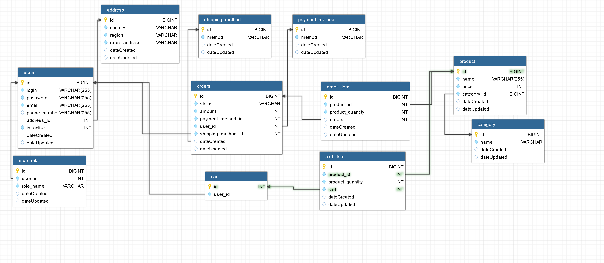

# neobis-online-store
Online Book Store

**uml diagram:**

## endpoints:

**create address -> everyone has access.**
[POST] http://localhost:8080/api/address
_*{
	"country":"",
	"region":"",
	"exactAddress":""
}*_

**getAll addresses -> only ADMIN**
[GET] http://localhost:8080/api/address
Header-> Autorization : [token]

-----------------------------------------------------------

**create user -> everyone has access.**
[POST] http://localhost:8080/api/user
_*{
	"login":"",
	"password":"",
	"email":"",
	"phoneNumber":"",
	"addressId":"",
	"isActive":""
}*_

get token(для авторизации нужно) -> everyone has access.
[POST] http://localhost:8080/api/user/auth
{
	"login":"",
	"password":""
}

get meUser(посмотреть только свои данные) -> ADMIN, CUSTOMER
[GET] http://localhost:8080/api/user/my
Header-> Autorization : [token]

getAll users -> only ADMIN
[GET] http://localhost:8080/api/user/all
Header-> Autorization : [token]

-----------------------------------------------------------

create UserRole -> only ADMIN
[POST] http://localhost:8080/api/user-role
{
	"roleName":"ROLE_CUSTOMER",
	"userId":"1"
}
Header-> Autorization : [token]

update UserRole -> only ADMIN
[PUT] http://localhost:8080/api/user-role
{
	"roleName":"",
	"user":{
	...
	}
}
Header-> Autorization : [token]

get all userRoles -> only ADMIN
[GET] http://localhost:8080/api/user-role
Header-> Autorization : [token]

getAllByRoleName-> only ADMIN
[GET] http://localhost:8080/api/user-role/role
Header-> Autorization : [token]

deleteById userRole -> only ADMIN
[DELETE] http://localhost:8080/api/user-role/{id}
Header-> Autorization : [token]

-----------------------------------------------------------

create category -> onlu ADMIN
[POST] http://localhost:8080/api/category
{
	"name":""
}
Header-> Autorization : [token]

get all categories -> everyone has access.
[GET] http://localhost:8080/api/category

deleteById category -> only ADMIN
[GET] http://localhost:8080/api/category
{
	"id":""
}
Header-> Autorization : [token]

-----------------------------------------------------------

create product -> only ADMIN
[POST] http://localhost:8080/api/product
{
	"name":"",
	"price":"",
	"categoryId":""
}
Header-> Autorization : [token]

update product -> only ADMIN
[PUT] http://localhost:8080/api/product
{
	"id":"",
	"name":"",
	"price":"",
	"categoryId":""
}
Header-> Autorization : [token]

getAll product - > everyone has access.
[GET] http://localhost:8080/api/product

getById product - > everyone has access.
[GET] http://localhost:8080/api/product/{id}

deleteById product - > only ADMIN
[DELETE] http://localhost:8080/api/product
multipartFile-> id:""

getAllByName xproduct - > everyone has access.
[GET] http://localhost:8080/api/product/{name}

getAllByPriceBetween product - > everyone has access.
[GET] http://localhost:8080/api/product/price
multipartFile-> from:"", to:""

getAllByCategoryName product - > everyone has access.
[GET] http://localhost:8080/api/product/category
multipartFile-> name:""

getAllByDateTimeAfter product - > everyone has access.
[GET] http://localhost:8080/api/product/dateTime
multipartFile-> dateTime:""

-----------------------------------------------------------

create cartItem-> ADMIN, CUSTOMER
[POST] http://localhost:8080/api/cart_item
{
	"productQuantity":"",
	"product":{
	 ...
	}
}
Header-> Autorization : [token]

deleteById cartItem-> ADMIN, CUSTOMER
[DELETE] http://localhost:8080/api/cart_item/{id}
Header-> Autorization : [token]

getById cartItem-> ADMIN, CUSTOMER
[GET] http://localhost:8080/api/cart_item/{id}
Header-> Autorization : [token]

get all cartItems in user's cart -> ADMIN, CUSTOMER
[GET] http://localhost:8080/api/cart_item
Header-> Autorization : [token]

-----------------------------------------------------------

create paymentMethod -> only ADMIN
[POST] http://localhost:8080/api/payment_method
{
	"method":"с карточкой. (VIZA)"
}
Header-> Autorization : [token]

deleteById paymentMethod -> only ADMIN
[DELETE] http://localhost:8080/api/payment_method/id
Header-> Autorization : [token]

getAll paymentMethods - > everyone has access.
[GET] http://localhost:8080/api/payment_method

getById paymentMethod  - > everyone has access.
[GET] http://localhost:8080/api/payment_method/{id}

-----------------------------------------------------------

create shippingMethod -> only ADMIN
[POST] http://localhost:8080/api/shipping_method
{
	"method":"на такси за один день. 300с за 1км"
}
Header-> Autorization : [token]

deleteById shippingMethod -> only ADMIN
[DELETE] http://localhost:8080/api/shiipng_method/id
Header-> Autorization : [token]

getAll shippingMethod - > everyone has access.
[GET] http://localhost:8080/api/shiipng_method

getById shippingMethod - > everyone has access.
[GET] http://localhost:8080/api/shiipng_method/{id}

-----------------------------------------------------------

create order -> only CUSTOMER
[PUT] http://localhost:8080/api/order/create
{
	"paymentMethod": {
		...
	 },
	"shippingMethod": {
		...
	}
}
Header-> Autorization : [token]

change orderStatus -> only ADMIN
[PUT] http://localhost:8080/api/order/delivered
{
...
}
Header-> Autorization : [token]

getByUserLogin order - > only ADMIN.
[GET] http://localhost:8080/api/order
{ 
	"login":""
}

getAllByDateTimeCreatedBetween - > only ADMIN.
[GET] http://localhost:8080/api/order/date
MultipartFile-> a:"", b:""
Header-> Autorization : [token]

getAllByStatus- > only ADMIN.
[GET] http://localhost:8080/api/order/status
MultipartFile-> status:""
Header-> Autorization : [token]

getAllByAmountBetween- > only ADMIN.
[GET] http://localhost:8080/api/order/amount
MultipartFile-> a:"", b:""
Header-> Autorization : [token]

getAllByPaymentMethodAndDateTimeCreatedAfter- > only ADMIN.
[GET] http://localhost:8080/api/order/paymentAndDate
MultipartFile-> method:"", dateTime:""
Header-> Autorization : [token]

-----------------------------------------------------------

create orderItem -> only CUSTOMER
[POST] http://localhost:8080/api/order_item
{
	"productQuantity":"",
	"product":{
	 ...
	 }
}
Header-> Autorization : [token]

deleteById orderItem -> CUTOMER, ADMIN
[DELETE] http://localhost:8080/api/order_item/{id}
Header-> Autorization : [token]

getById orderItem -> CUTOMER, ADMIN
[GET] http://localhost:8080/api/order_item/{id}
Header-> Autorization : [token]

getAllMy orderItems -> CUTOMER, ADMIN
[GET] http://localhost:8080/api/order_item
Header-> Autorization : [token]

